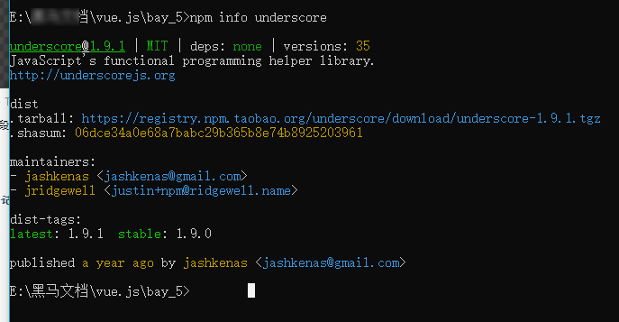

# js学习的笔记


11月12号更新  更新第二部分内容

11月8号 更新第二部分

整理集合Vue部分的笔记,

Vue 基础, 除了

声明周期,组件化过度动画 ,

规模化, 状态管理,迁入迁出

--坑有点多--慢慢填


在更新数据笔记的过程中,遇到更换镜像的问题,

```npm
在cmd中输入这个更换 数据镜像源
npm config set registry https://registry.npm.taobao.org
```

使用

```js
npm info underscore
```

查询npm的 镜像地址记录




11/2日凌晨 --更新第一部分

开始计划整理Vue的学习笔记

整理js基础知识系统 就是吧数组的和对象的组合到一个文件里面

又挖了数个填不完的大坑

补充数组操作方法,修改了部分笔记的错字


与10/18号整理主要界面

* 整理包括git的简略使用方法
  * 终于记住了git命令了不会吧命令放到主要界面显示

9/22日更新笔记至WEBaip并使用自定义的导航栏

- 创建了导航栏


​	- 更新了面试笔记和案例

9/19日创建并上传js基础知识

* 使用docsify渲染页面笔记


