## Git学习笔记

### 注意事项

* Git 中的所有命令的每一个部分都需要使用空格隔开
* 在使用远程仓库的时候要遵循**先拉后推**的原则

### 创建一个仓库

* 使用Git命令去管理这个仓库(文件夹)的时候必须先初始化这个仓库

* 使用==git init==初始化这个仓库

  * 当你通过git init命令变成Git仓库的时候这个文件夹下面会出现一个.git的隐藏文件夹,我们Git仓库里面的所有历史记录都保存在这个文件夹里面(包括修改删除/版本)

  

* 使用==git add .== 可以把工作区的文件存储到暂存区
  
  * 暂存区-->指暂时存放的区域
* 使用==git commit -m `注释`== 可以把暂存区的文件保存到仓库区(本地仓库)
  
  * 本地仓库 --> 指的是已经有**版本号**储存至仓库 随时可以通过命令滚回版本
* 我们可以通过==git diff `文件名  `== 来查看文件的修改内容
  * 这个命令可以查看非二进制文件内部 的修改内容 
  * 二进制文件指的是图片音频, diff 并不能查看文件内容到底修改了什么 
* 使用==git status==查看文件的状态
  * 文件的状态有三种
  * 一种是红色==> 新添加未保存至暂存区
  * 一种是绿色 ==> 以保存至仓库区
* 使用==git log==查看仓库的历史记录
  * 使用git log --oneline 可以查看简化版的历史记录
  
  * 
  
  * >  使用git reflog 可以查看带head{$} 版本历史记录

### 切换版本

- 只要是保存到仓库的文件都会有版本号
- 需要退回上一个版本可以使用两种命令
  - 一种:
    - git reset --hard HEAD^ name如果需要退回上上个版本只需要把HEAD^改成HEAD^^    以此类推
    - name如果需要退回100个版本的话肯定就不方便
  - 二种
    - git reset --hard 版本号

### 撤销修改和删除文件操作

1.撤销修改

* 有两种方法可以做修改
  * 一种: 如果我们要知道要删除那些内容的话,直接手动更改掉那些需要的文件,然后add添加到暂存区,最后commit掉
  * 二种: 我们可以按照以前的方法直接回复到上一个版本,使用 `git reset --hard HEAD^`
* 但是我们不想使用上面的两种方式,我想直接使用撤销命令该如何操作呢? 首先在做撤销之前,我们可以先使用 git status 产看下当前的状态 ,   
* 当查看状态的时候 Git 会告诉我们 git checkout -- file 可以丢弃到工作区的内容 
* 命令git checkou --文件名 意思就是把这个文件在工作区做的修改全部撤销 ---这里会有两种情况
  * 如果这个文件自动修改过后,还没有防盗暂存区,使用 撤销修改就回到和版本库一模一样的状态.
  *  另一种是文件已经放入咱群去, 接着又做了修改,撤销修改就回到添加暂存区后的状态
  * 对于第二种命令 加入我们对文件添加过内容之后 使用git add文件增加到暂存区后,接着又添加了内容,这时候我相同故宫撤销命令让其回到暂存区后的状态,

`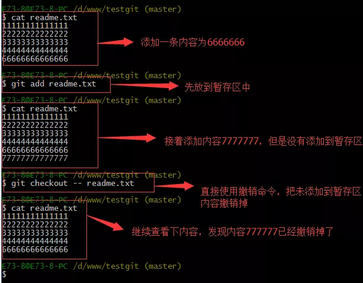

注意: 使用git checkout -- 文件名中的  ==--== 很重要,如果没有 ==--==的话那么命令编程了创建分支了.


### 删除文件

假如我们向版本库中的文件目录中添加了一个文件,然后提交,

> 现在版本库中有我这个文件, 但现在我又删除了这个文件, 如果我想版本库中的文件也删除的情况
>
> 一般我可以在本地文件夹自行删除文件,之后添加到暂存区之后使用commit 提交整个文件到仓库
>
> 等于新建一个没有这个文件的版本

但只要是没有commit 之前,如果我想在版本库恢复这个文件该怎么操作呢?

可以使用 ==git checkout --文件名== 


### 远程仓库

如何添加远程仓库?

现在的情景是: 我们已经在本地创建了一个Git仓库,又想在github创建一个仓库, 并且希望这两个仓库进项远程同步,这样github的仓库可以作为备份,又可以其他人通过该仓库来写作

首先在github上,创建一个新的仓库

注意不要在创建的时候添加说明文件

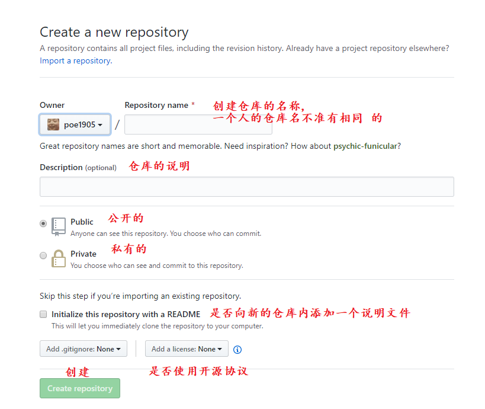

点击创建之后,我们就的到了一个保存我们代码的一个仓库了


目前,在gitHub上面这个仓库还是空的,Github告诉我们,可以从这个仓库克隆出新的仓库,也可以把一个已有的本地仓库与之关联,然后把本地仓库的内容推送到GitHub仓库

现在我们根据GitHub的提示，在本地的testgit仓库下运行命令：

```git
git remote add origin https://github.com/tugenhua0707/testgit.git
```

把本地仓库的内容推送到远程 ,使用 git push 命令,实际上就就是把当前分支 推送到远程仓库,

但由于远程仓库的空的,我们第一次推送的收,加上了-u   参数,Git不但会把本地的master 分支内容,推送到远程新建的master分支,还会把本地master  和远程master  分支,关联起来,在以后推送或者拉取的时候就可简化命令,推送成功后,可以立即在gitHub页面中看到远程库的内容跟本地一模一样了


至此之后向往这个仓库推送更新就可以通过

```git
git push origin master
```

把本地的主分支(master)的最新修改推送到github上

#### 如何从远程克隆?


在本地的文件夹内使用  clone命令

```git
git clone 仓库地址
```

点击之后会在本地生成一个新的仓库,就是克隆过来的仓库

#### 创建分支与合并分支

> 在版本回填退里，你已经知道，每次提交，Git都把它们串成一条时间线，这条时间线就是一个分支。截止到目前，只有一条时间线，在Git里，这个分支叫主分支，即master分支。HEAD严格来说不是指向提交，而是指向master，master才是指向提交的，所以，HEAD指向的就是当前分支。

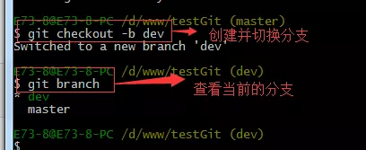

> git checkout 命令加上 –b参数表示创建并切换，相当于如下2条命令
>
> ```
> git branch dev
> git checkout dev
> ```
>
> git branch查看分支，会列出所有的分支，当前分支前面会添加一个星号。然后我们在dev分支上继续做demo，比如我们现在在readme.txt再增加一行 7777777777777
>
> 首先我们先来查看下readme.txt内容，接着添加内容77777777，如下：


> 现在dev分支工作已完成，现在我们切换到主分支master上，继续查看readme.txt内容如下：

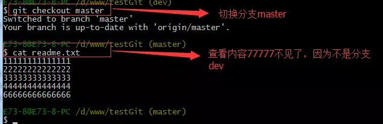


> 现在我们可以把dev分支上的内容合并到分支master上了，可以在master分支上，使用如下命令 git merge dev 如下所示：

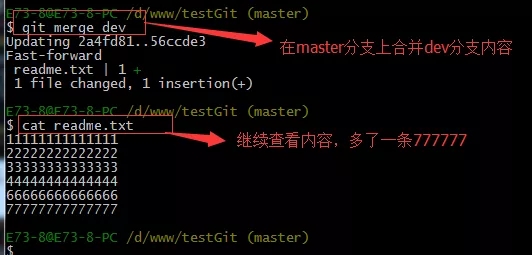


> git merge命令用于合并指定分支到当前分支上，合并后，再查看readme.txt内容，可以看到，和dev分支最新提交的是完全一样的。
>
> 注意到上面的Fast-forward信息，Git告诉我们，这次合并是“快进模式”，也就是直接把master指向dev的当前提交，所以合并速度非常快。
>
> 合并完成后，我们可以接着删除dev分支了，操作如下：

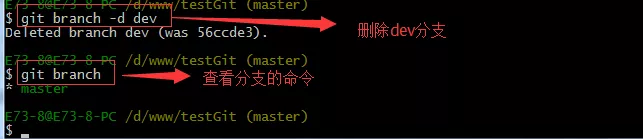

> 总结创建与合并分支命令如下：
>
> 查看分支：git branch
>
> 创建分支：git branch name
>
> 切换分支：git checkout name
>
> 创建+切换分支：git checkout –b name
>
> 合并某分支到当前分支：git merge name
>
> 删除分支：git branch –d name
>
> 如何解决冲突？
> 下面我们还是一步一步来，先新建一个新分支，比如名字叫fenzhi1，在readme.txt添加一行内容8888888，然后提交，如下所示


> 同样，我们现在切换到master分支上来，也在最后一行添加内容，内容为99999999，如下所示：

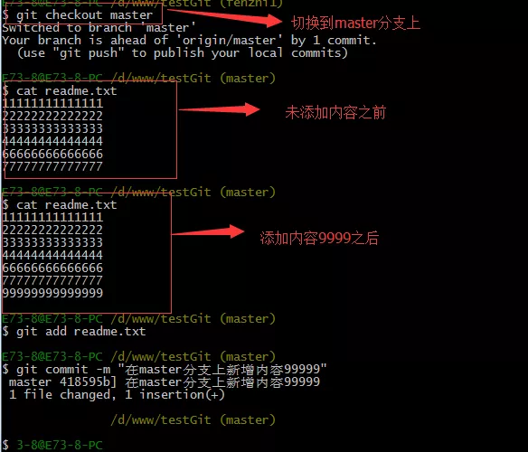

> 现在我们需要在master分支上来合并fenzhi1，如下操作：

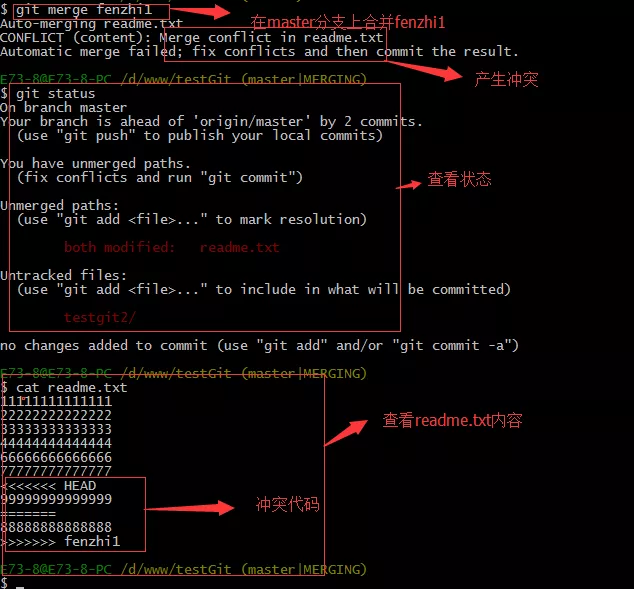

> Git用<<<<<<<，=======，>>>>>>>标记出不同分支的内容，其中<<<HEAD是指主分支修改的内容，>>>>>fenzhi1 是指fenzhi1上修改的内容，我们可以修改下如下后保存：

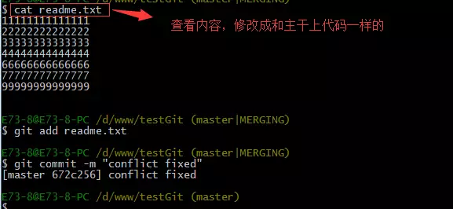


> 如果我想查看分支合并的情况的话，需要使用命令 git log.命令行演示如下：


> 3.分支管理策略。通常合并分支时，git一般使用”Fast forward”模式，在这种模式下，删除分支后，会丢掉分支信息，现在我们来使用带参数 –no-ff来禁用”Fast forward”模式。首先我们来做demo演示下：
>
> - 创建一个dev分支。
> - 修改readme.txt内容。
> - 添加到暂存区。
> - 切换回主分支(master)。
> - 合并dev分支，使用命令 git merge –no-ff -m “注释” dev
> - 查看历史记录
>
> 截图如下：


> 分支策略：首先master主分支应该是非常稳定的，也就是用来发布新版本，一般情况下不允许在上面干活，干活一般情况下在新建的dev分支上干活，干完后，比如上要发布，或者说dev分支代码稳定后可以合并到主分支master上来。

#### bug分支

> 在开发中，会经常碰到bug问题，那么有了bug就需要修复，在Git中，分支是很强大的，每个bug都可以通过一个临时分支来修复，修复完成后，合并分支，然后将临时的分支删除掉。
>
> 比如我在开发中接到一个404 bug时候，我们可以创建一个404分支来修复它，但是，当前的dev分支上的工作还没有提交。比如如下：

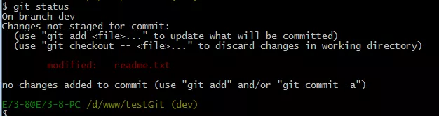

> 并不是我不想提交，而是工作进行到一半时候，我们还无法提交，比如我这个分支bug要2天完成，但是我issue-404 bug需要5个小时内完成。怎么办呢？还好，Git还提供了一个stash功能，可以把当前工作现场 ”隐藏起来”，等以后恢复现场后继续工作。如下：


> 所以现在我可以通过创建issue-404分支来修复bug了。
>
> 首先我们要确定在那个分支上修复bug，比如我现在是在主分支master上来修复的，现在我要在master分支上创建一个临时分支，演示如下：

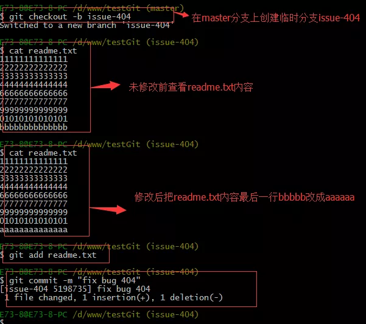

> 修复完成后，切换到master分支上，并完成合并，最后删除issue-404分支。演示如下：

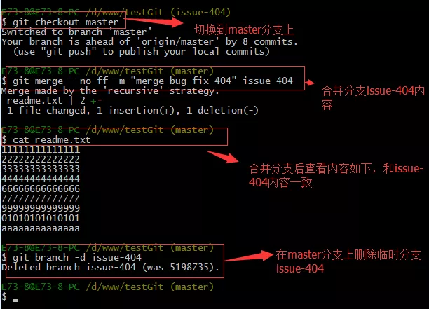

> 现在，我们回到dev分支上干活了。 

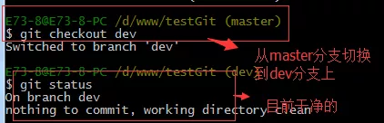

> 工作区是干净的，那么我们工作现场去哪里呢？我们可以使用命令 git stash list来查看下。如下：

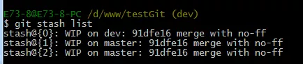

> 
> 工作现场还在，Git把stash内容存在某个地方了，但是需要恢复一下，可以使用如下2个方法：
>
> 1.git stash apply恢复，恢复后，stash内容并不删除，你需要使用命令git stash drop来删除。
> 2.另一种方式是使用git stash pop,恢复的同时把stash内容也删除了。
> 演示如下

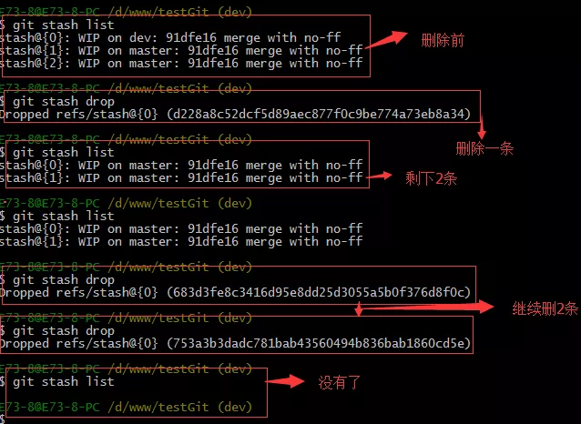

### 多人协作


> 当你从远程库克隆时候，实际上Git自动把本地的master分支和远程的master分支对应起来了，并且远程库的默认名称是origin。
>
> 1. 要查看远程库的信息 使用 git remote
> 2. 要查看远程库的详细信息 使用 git remote –v
>
> 如下演示：

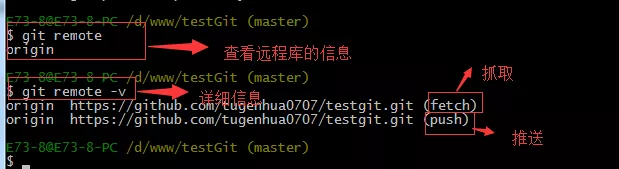

#### 1.推送分支


推送分支就是把该分支上所有本地提交到远程库中，推送时，要指定本地分支，这样，Git就会把该分支推送到远程库对应的远程分支上：使用命令 git push origin master

比如我现在的github上的readme.txt代码如下：


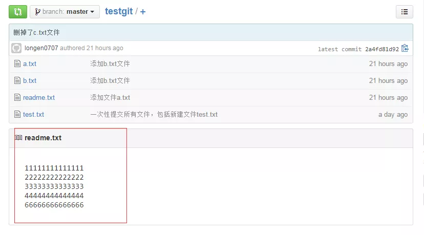

> 本地的readme.txt代码如下：

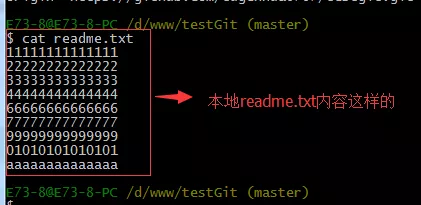

> 现在我想把本地更新的readme.txt代码推送到远程库中，使用命令如下：

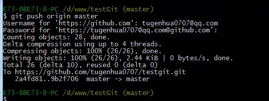

> 我们可以看到如上，推送成功，我们可以继续来截图github上的readme.txt内容 如下：

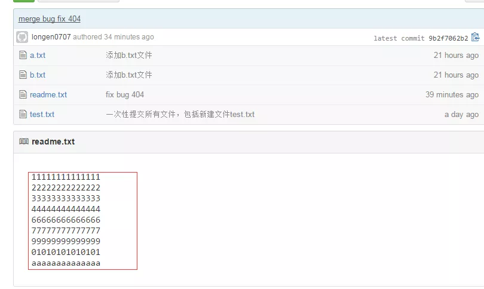

> 
> 可以看到 推送成功了，如果我们现在要推送到其他分支，比如dev分支上，我们还是那个命令 git push origin dev
>
> 那么一般情况下，那些分支要推送呢？
>
> master分支是主分支，因此要时刻与远程同步。
> 一些修复bug分支不需要推送到远程去，可以先合并到主分支上，然后把主分支master推送到远程去。


#### 2.抓取分支


> 多人协作时，大家都会往master分支上推送各自的修改。现在我们可以模拟另外一个同事，可以在另一台电脑上（注意要把SSH key添加到github上）或者同一台电脑上另外一个目录克隆，新建一个目录名字叫testgit2
>
> 但是我首先要把dev分支也要推送到远程去，如下

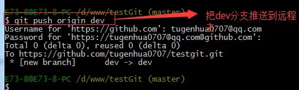

> 接着进入testgit2目录，进行克隆远程的库到本地来，如下：

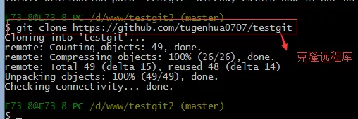

> 现在目录下生成有如下所示：

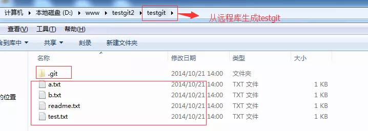

> 现在我们的小伙伴要在dev分支上做开发，就必须把远程的origin的dev分支到本地来，于是可以使用命令创建本地dev分支：
>
> ```
> git checkout –b dev origin/dev
> ```
>
> 现在小伙伴们就可以在dev分支上做开发了，开发完成后把dev分支推送到远程库时。
>
> 如下：


> 小伙伴们已经向origin/dev分支上推送了提交，而我在我的目录文件下也对同样的文件同个地方作了修改，也试图推送到远程库时，如下：


> 由上面可知：推送失败，因为我的小伙伴最新提交的和我试图推送的有冲突，解决的办法也很简单，上面已经提示我们，先用git pull把最新的提交从origin/dev抓下来，然后在本地合并，解决冲突，再推送。

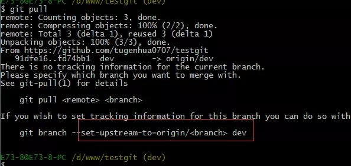

> git pull也失败了，原因是没有指定本地dev分支与远程origin/dev分支的链接，根据提示，设置dev和origin/dev的链接：如下：

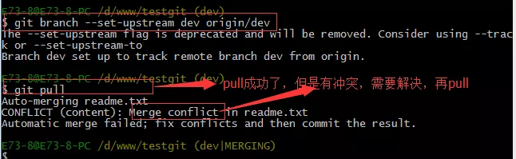

> 这回git pull成功，但是合并有冲突，需要手动解决，解决的方法和分支管理中的 解决冲突完全一样。解决后，提交，再push：
> 我们可以先来看看readme.txt内容了。


> 现在手动已经解决完了，我接在需要再提交，再push到远程库里面去。如下所示：

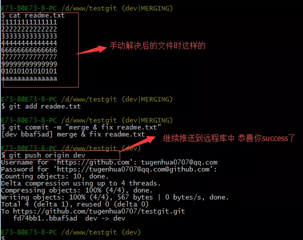

> 因此：多人协作工作模式一般是这样的：
>
> 首先，可以试图用git push origin branch-name推送自己的修改.
> 如果推送失败，则因为远程分支比你的本地更新早，需要先用git pull试图合并。
> 如果合并有冲突，则需要解决冲突，并在本地提交。再用git push origin branch-name推送。