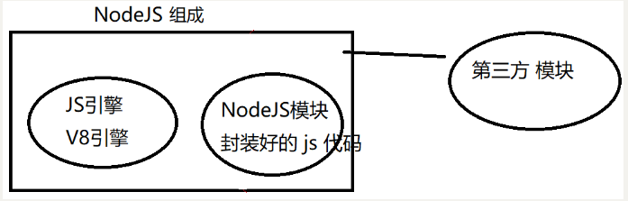
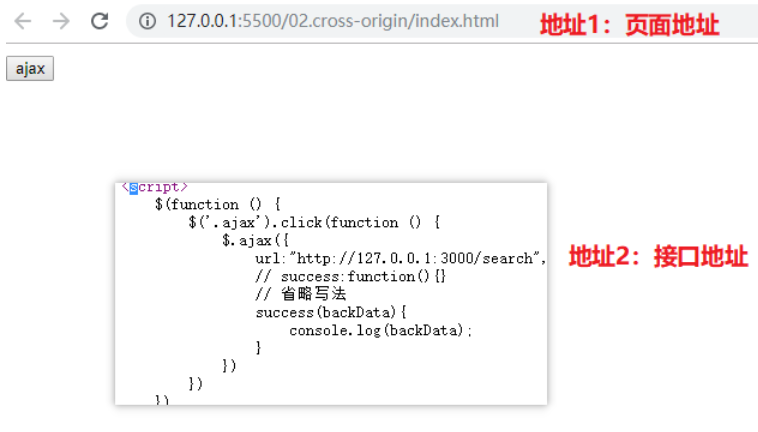
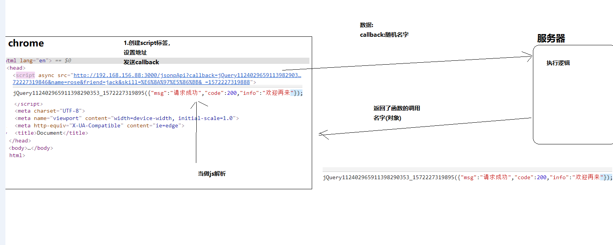

# Node.js

## 介绍:

> 简单的说 Node.js 就是运行在服务端的 JavaScript。
>
> Node.js 是一个基于Chrome JavaScript 运行时建立的一个平台。
>
> Node.js是一个事件驱动I/O服务端JavaScript环境，基于Google的V8引擎，V8引擎执行Javascript的速度非常快，性能非常好。

### NodeJs的核心组成



* 因为模块是内置模块,在安装Nodejs的时候就已经装在了硬盘中
* 直接可以在安装了的nodejs的电脑中使用,不需要下载
*  https://www.runoob.com/nodejs/nodejs-tutorial.html (菜鸟教程--荐)

## 使用

介绍:

> node内部提供了大量的内置模块供我们使用
>
> 如果使用内置的模块就不需要导入包
>
> 在npm官网上面也提供了大量的第三方的软件包可以公开使用
>
> 所以有两种情况,如果使用内置的模块的时候只要每次使用的时候就引入模块
>
> 但是如果使用第三方的模块的时候就必须使用npm先把包下载到本地之后再进行引入和使用

### 同步和异步

##### 同步

* 在代码中:代码是从上往下执行的
* 现实中: 排队

##### 异步

* 代码中: 多段代码一起执行(调用的顺序和预料的不通)
  * 例如定时器
  * 还有ajax中的异步操作
* 现实中: 一个人同事做多件事情:互不影响

##### 注意

* 绝大多是代码都是同步的
* Nodejs中有大量的异步的方法: 如果有回调函数的大部分处理请求都是异步的
* 如果这个事件跟网络有关系,跟硬盘和内存打交道的操作一般都是异步的:
  * 定时器
  * fs读写文件
  * ajax(浏览器)
  * jQuery动画的回调函数

### 路径

* 绝对路径
  * 从盘符一直到目标文件的路径: e:下载/文件夹
  * 网络绝对路径 : http://www.baidu.com/index.html

* 相对路径

  * 顾名思义:相对路径就是相对于某一个存在的一个路径
  * 也就是有一个参考目标的一个路径
  * 一般都是相对于正在执行的文件而言: ./a.text

  **但是nodejs中的相对路径不是相对于正咋运行中的文件,而是相对于小黑窗口中的执行路径**

### node路径问题

> node js中的相对路径是相对于正在**运行中的终端**而言,**不是针对于正在运行的js文件**
>
> 使用node操纵路径时使用绝对路径的时候有可能出错
>
> 一般在nodejs中使用的都是上面都会引入包的时候都会使用绝对路径

### 两个绝对路径

`__dirname`：获取执行的js文件所处的文件夹的 **绝对路径**

`__filename`：获取执行的js文件自己的 **绝对路径**

可以用`__dirname`拼接一个完成的绝对路径

```js
const fs = require(`fs`);

/* //dir neme 是文件的相对路径
console.log(__dirname);
// file name是文件的完整使用相对路径
console.log(__filename); */

const fullpath = __dirname + `\\web\\index.text`
fs.readFile(fullpath, `utf8`, (arr, data) => {
    // console.log(arr);
    // console.log(data);
    if (arr == null) {
      console.log(`读取成功`);
      console.log(`
      读取的结果为 :  ${data}
      `);
    } else {
      console.log(`读取失败`);
    }
  })
  // console.log(fullpath);
```

* 注意: 
  * 1.在NodeJs中不要使用相对路径,而要使用绝对路径
  * 2.绝对路径的安全获取方式:__dirname+ 相对于`针对于当前执行的js文件的 布标的相对路径`

## 模块

注意: **引入模块之前必须初始化目录**

```js
npm init -y
```

在那个目录使用模块就在那个地方初始化

### Path模块

**path  [pɑːθ]  /路径/小径/小路**

**__dirname**,==> 指的是当前命令窗口在整个系统中的绝对路径 就是路径

> E:\nodejs\bay_2\ces.js

__filename,==> 指的是当前文件在系统中的完整路径带文件名的路径

> E:\\nodejs\bay_2

隐型**全局变量** (不用声明就可以使用的变量)

------


#### path.basename(path[, ext])

* path<seting>(文件路径,绝对路径或者相对路径)(必选参数)
* [.ext]<seting>(可选参数)

* 返回<seting>

> basename()方法用来取路径中的文件名
>
> 使用可选参数可以去掉文件的拓展名

```js
path.basename('/foo/bar/baz/asdf/quux.html');
// 返回: 'quux.html'

path.basename('/foo/bar/baz/asdf/quux.html', '.html');
// 返回: 'quux'
```

#### path.dirname(path)

* path<scting>(路径)
* 返回<seting>路径

> 返回传入目录的路径部分
>
> 注: 不管是绝对路径还是相对路径都返回路径部分

```js
> path.dirname(`/wode/cs/ni/nihao.text`)
'/wode/cs/ni'
> path.dirname(`c:/nihao/dsafew/buhao.html`)
'c:/nihao/dsafew'
```

#### path.extname(path)

* path<scting>(路径)
* 返回<seting>路径

> 获取路径中**从**后面往前 , 遇到的第一个点后面的内容, 也就是拓展名
>
> 注: **如果 `没有`文件名的特殊文件,获取不到文件拓展名**

```js
> path.extname(`/d/小兔子跳铃铛/.gitignore`)
''
> path.extname(`/d/小兔子跳铃铛/11.gitignore`)
'.gitignore'
> path.extname(`/d/小兔子跳铃铛/11.giti.gnore`)
'.gnore'
```

#### path.join([paths])

* 负责拼接生成路径
* 语法path.join(`路径1`    ,    `路径2`    ,   `路径`  , .........)
* 一般使用: path.join(__dirname , `./web/index.html`)

```js
// 导入 fs
const fs = require(`fs`);
// 导入 path
const path = require(`path`);
// 路径拼接
const full = path.join(__dirname, `./web/index.text`)
console.log(full);
console.log(`__________________________________`);
const 拓展文件名 = path.extname(`./web/index.text`)
console.log(`获取目标文件的拓展名` + 拓展文件名);
console.log(`__________________________________`);
const 文件名 = path.dirname(`./web/index.text`)
console.log(`获取到文件在路径中文件夹的名字` + 文件名);
```

> 注意: 使用绝对路径的目的是`保证一定可以获取到文件`

#### path.barse(path)

* path <scting>
* 返回<scting>(一个对象)

```js
path.parse(`c:/as/bay_2/snaj.text`)
{
  root: 'c:/',			//绝对路径
  dir: 'c:/as/bay_2',	//完整路径
  base: 'snaj.text',	//完整文件名
  ext: '.text',			//文件拓展名
  name: 'snaj'			//文件名
}
```


### fs文件处理模块

#### fs.open()方法

>  字符串形式的路径被解析为标识绝对或相对文件名的 UTF-8 字符序列。 相对路径将相对于 `process.cwd()` 指定的当前工作目录进行解析。 

#### fs.readFile(path[, options], callback)

```js
fs.readFile(path,`字符集`,fu(){})
异步的去读取文件的全部内容
```

* path: 为读取文件的路径

*   options (可选) : 以什么字符集去解析读到的文件

* fu(arr,data){}

  * arr读文件的状态,如果读取成功则没有值,如果读取失败则爆出错误对象
  * data,读到的数据

### http模块--创建服务器

> 通过http模块可以轻松的创建一个服务器

#### 步骤

1. 导包(内置模块,模块名`http`
2. 调用`createServer` 方法
3. 开启服务器(监听端口)`listen()`

```js
const http = require(`http`)

// const path = require (`path`)
const server = http.createServer((reuqst, response) => {
  response.setHeader('content-type', 'text/plain;charset=utf-8')
  response.end(`我是一台服务器哟`)

})

server.listen(8848, err => {
  //   console.log(err);
  console.log(`开启成功`);


})
```

问题:

> 1.设置setHeader的代码不能乱写
>
> 2.访问的时候,写上端口号
>
> 3.开始现导包`http`


### 第三方模块

####  body-parser


> 通过引入body-parer包  可以获取post请求中的数据(data)
>
> 传送门 : [body-parser]( https://www.npmjs.com/package/body-parser )

* **使用方法**

  1. 下包

  ```js
  npm i body-parser
  ```

  2. 引包

  ```js
  var bodyParser = require('body-parser')
  ```

  3. 用包

  ```js
  //获取post 文本类型请求的
  // parse application/x-www-form-urlencoded
  app.use(bodyParser.urlencoded({ extended: false }))
  //获取post json数据类型的请求 
  // parse application/json
  app.use(bodyParser.json())
  ```
  
  实例代码:
  
  ```js
  const express = require('express')
  const fs = require(`fs`)
  const path = require(`path`)
  const app = express()
    // 引入post 请求的第三方包
  const bodyParser = require('body-parser')
  
  /**
   * 定义post请求的参数
   * 例如urse:
   * 例如age:
   */
  // const urlencodedParser = bodyParser.urlencoded({ extended: false })
  // const jsonParser = bodyParser.json()
  app.use(bodyParser.urlencoded({ extended: false }))
  
  app.post(`/ust`, (req, res) => {
    //   console.log(req.query.urse);
  
    console.log(req.body);
    //   console.log(req.query);
    const 用户名 = req.body.urse
    const 年龄 = req.body.age
    const 用户资料库 = [`黑人`, `非洲人`, `非酋`]
    if (年龄 <= 20) {
      res.send(`小于20岁的不可以注册`)
    }
    // 用户资料库.indexOf(用户名)
    if (用户资料库.indexOf(用户名) == -1) {
      res.send(`可以注册`)
    } else {
      res.send(`请勿重复注册`)
    }
    //   res.send(`发送成功`)
  })
  
  // 开启服务器
  app.listen(3000, err => {
  
    if (!err) {
  
      console.log(`开启成功了`);
    }
  
  })
  ```
  
  

####   express-fileupload 

> 通过引入express-fileupload包  可以获取post请求中的 文件数据
>
> 传送门 : [express-fileupload](  https://www.npmjs.com/package/express-fileupload  )

* **使用方法**

  1. 下包

  ```js
  npm i express-fileupload
  ```

  2. 引包

  ```js
  const fileUpload = require('express-fileupload');
  ```

  3. 用包

  ```js
  //在中间件中执行这个模块
  // default options
  app.use(fileUpload());
  ```
  
  注:在使用第三方模块 的时候一定要看官方文档
  
  实例代码:
  
  ```js
  const express = require('express')
  const fs = require(`fs`)
  const path = require(`path`)
  
  const app = express()
  
  // 引入第三方的文件包
  const fileUpload = require('express-fileupload');
  // 使用第三方的文件包
  app.use(fileUpload());
  /*** 引入第三方文件处理包*/
  app.post('/upload', function(req, res) {
  
  //使用path.join()方法拼接绝对路径 			获取上传到服务器文件的名字
    const url = path.join(__dirname, `./web`, req.files.add.name)
    //返回客户端消息
    res.send(`发送成功哦`)
      //   Use the mv() method to place the file somewhere on your server
      
      //使用mv移动文件到保存文件的目录
    req.files.add.mv(url, function(err) {
      // console.log(arr);
      console.log(`保存成功了 `);
    });
  });
  
  
  // 开启服务器
  app.listen(3000, err => {
    if (!err) {
      console.log(`开启成功了 `);
    }
  })
  ```
  
  

####   nodemon 

> 通过全局安装 nodemon模块可以使用 nodemon 代替node命令去启动js代码
>
> 可以检测被执行文件的保存情况
>
> 如果保存则关闭服务,重新运行文件
>
> 传送门 : [nodemon](  https://www.npmjs.com/package/nodemon  )

* 使用方法

  1. 下包

  ```js
  npm i nodemon
  ```

  2. 引包

  ```js
   不需要引入 ,因为是在启动阶段操作
  ```

  3. 用包

  ```js
  node 01.index.js//使用原来 node 去启动程序, 如果文件修改之后需要关闭服务重新执行以下代码
  
  使用nodemon之后可以:
  nodemon 01.index.js //执行文件,这样文件执行一次就可以了  ,修改文件保存之后,ondemon会自动的关闭服务自动启用服务
  ```

 mysql-ithm 
####    mysql-ithm   

> 技术亮点:
>
> - (1)基于ORM技术，使用对象的方式来操作mysql数据库，而无需编写任何sql语句
> - (2)支持数据库的常规操作`增删改查`，API极为简洁，且高效智能。
> - (3)支持条件查询 与 分页查询
> - (4)支持原生sql语句，如果我们的框架无法满足您的需求，我们也提供了特殊的API可以直接使用sql语句来操作
> - (5)支持链式语法
>
> 传送门 : [mysql-ithm]( https://www.npmjs.com/package/mysql-ithm   )

* 使用方法

  1. 下包

  ```js
  npm i mysql-ithm
  ```

  2. 引包

  ```js
  //导入模块
  const mysql = require('mysql');
const hm = require('mysql-ithm');
  ```

  3. 用包
  
  ```js
  //1.导入模块
  const mysql = require('mysql');
  const hm = require('mysql-ithm');
   
  //2.连接数据库
  //如果数据库存在则连接，不存在则会自动创建数据库
  hm.connect({
      host: 'localhost',//数据库地址
      port:'3306',
      user: 'root',//用户名，没有可不填
      password: 'root',//密码，没有可不填
      database: 'hm'//数据库名称
  });
   
  //3.创建Model(表格模型：负责增删改查)
  //如果table表格存在则连接，不存在则自动创建
  let studentModel = hm.model('student',{
      name:String,
      age:Number
  });
   
  //4.调用API：添加数据
  studentModel.insert({name:'张三10',age:30},(err,results)=>{
      console.log(err);
      console.log(results);
      if(!err) console.log('增加成功');
  });
  ```

##### 增

>  增加数据操作

```js
studentModel.insert({name:'张三',age:`22`},(arr,results)=>{
    console.log(`arr`);
    console.log(`results`);
    if(!arr) console.log(`增加成功`)
})
```

##### 查

> 查询所有数据

```js
//2.1 查询所有数据
studentModel.find((err,results)=>{
    console.log(results);
});
```

> 查询数据库指定字段数据

```js
//2.2 根据数据库字段查询部分数据
// ['name'] : 将要查询的字段放入数组中
studentModel.find(['name'],(err,results)=>{
    console.log(results);
});
```

> 查询条件

```js
//2.3 根据条件查询数据
// 'id=1' : 查询id为1的数据 (查询条件可以参考sql语句)
//例如 'age>10' : 查询age超过10的数据 
//例如 'name>"张三"' : 查询名字为张三的数据，注意字符串添加引号
studentModel.find('id>21',(err,results)=>{
    console.log(results);
});
```

> 分页查询

```js
//2.4 分页查询
//  第一个参数options对象有三个属性 {where:分页查询条件（可选）， number:页数 ， count：每页数量}
studentModel.limit({where:'age>28',number:1,count:10},(err,results)=>{
    console.log(results);
});
```

##### 修改操作

1. 修改所有数据

   ```js
   //3.1 将数据库中所有的name字段值：修改为李四
   studentModel.update({name:'李四'},(err,results)=>{
       console.log(results);
   });
   ```

   

2. 条件修改

   ```js
   //3.2 将数据库中 id = 1 的数据，age修改为30
   studentModel.update('id=1',{age:30},(err,results)=>{
       console.log(results);
   });
    
   //3.3 将数据库中所有 age < 20 的数据，name修改为王五
   studentModel.update('age<20',{name:'王五'},(err,results)=>{
       console.log(results);
   });
   ```

##### 删除操作

```js
//4.1 删除所有 age>30 的数据
studentModel.delete('age>20',(err,results)=>{
    console.log(results);
});
 
//4.2 清空表中所有数据
studentModel.delete((err,results)=>{
    console.log(results);
});
```

##### 自定义SQL语句

```js
studentModel.sql('insert into student(name,age) values("andy",20)',(err,results)=>{
    console.log(results);
});
```

##### 删除表格 (慎用)

```js
studentModel.drop((err,results)=>{
    console.log(results);
});
```

##### 链式语法支持

```js
studentModel.insert({name:'张三22',age:22},(err,results)=>{
    console.log(err);
    console.log(results);
})
.find('name="张三22"',(err,results)=>{
    console.log(err);
    console.log(results);
});
```


## 跨域

### 介绍 

1. 什么是跨域

   跨域是ajax请求中发生的,如果ajax请求发出,是在不同源的情况下则会触发浏览器的报错,

   浏览器默认是不允许跨域的情况存在,因为不同源的请求在默认的事件行为当中,除了我皆是不可信任的

   所以浏览器默认就不允许跨域请求的存在,

   但在现今浏览器页面发展到此,很少的情况下浏览器的请求与 服务器的接口处于同源状态这样的话,浏览器与ajax请求的链接,全部都是跨域请求,前面说,跨域的请求皆是不可信任的,但要链接的请求是自己,就说明我信任这个站点,那么就需要浏览器允许跨域请求

2. 什么是同源

   > 协议,地址 (域名),端口 任意一个不相同就是跨域

    url 链接的组成 ` http://127.0.0.1:3000/search `

   1. 页面的地址协议, 如http:// 如https://
   2. 页面的链接地址, 192.168.156.22   127.0.0.1 
   3. 页面的请求端口  :3000   :5000  :8848

   浏览器页面地址与ajax请求的 地址处于同源就是页面的协议 页面的链接地址 和页面的端口都相同

   

### 跨域会发生什么

​	跨域会发生多个

1. 跨域怎么解决

   1.1 `jsonp` 是将页面的请求类型改为js请求, 不使用ajax请求也就不存在跨域问题

   1.2 `cors` 使用ES5的新技术 在后端路由中添上响应跨域的头部信息就可以解决跨域问题

2. 跨域的解决方法

### 跨域方案 -jsonp

> JSON with Paddding  利用了src属性的支持跨域访问实现了跨域请求
>
> ,虽然是民间的方法,也渐渐成为了一个大家伙约定成俗的标准了

1. 使用方法
   1. 前端
      1. $.ajax()
         1. url
         2. type: 必须是get
         3. success:fun(backData){}
         4. dataType: `jsonp`   **(最重要**)
   2. 后端
      1. `response.jsonp({key : value , key2 :  lavue 2})`
2. 注意: 
   1. 如果接口是`jsonp`
   2. 前端: 
      1. 需要把datape:`jsonp`
      2. 如果是type :  get  或者省略
      3. 数据dev发送和请求成功之后的回调函数和之前完全一样
   3. 后盾代码, 工作中不用我们写
   4. jsonp接口文档样式
      1. 请求地址:`接口地址`
      2. 请求方式: `jsonp` 
      3. 参数 `键值对`

### jsonp 原理

> 虽然这个方案现在用的越来越少, 但是面试还是经常问

1. script标签的src属性,可以发送请求,  没有`同源限制`

2. 和`AJAX`一点关系都没有:

   `network`分类选到`xhr`分类,什么都看不到

3. 本质是动态的创建了一个`script`标签添加到页面的顶部

   src设置的: `接口地址` + `发送的数据` + `callback=xxx`

4. 请求成功之后会被自动移除

5. 服务器返回了函数的调用 函数名({对象})

6. 内容返回到浏览器之后会被解析为`js`命令,调用定义好的函数,传入了一个参数jQuery的jsonp



自己写jsonp

在script 标签的src链接中写上请求接口的协议链接端口 ,加上?参数

参数: callbak=fn()&& 参数2 &&参数2

**介绍**: 

1. 虽然是民间的解决方案, 但是很好用, 广大的程序员就做好了约定
2. 你必须发送`callback()`回调函数
3. 后端也是通过`callback()`去获取方法名字

**优缺点**

1. 优点
   1. `兼容性` 好到令人发指
2. 缺点
   1. 不支持`post`请求
   2. 数据大的话,搞不定, 例如文件上传

### 跨域方案  - CORS (目前最为流行的方案)

> 需要后端配合
>
> 目前最为常用的一种跨域解决方案

1. CORS
   1. cross :跨/越
   2. origin : 域 /范围/区域
   3. resource : 资源
   4. share : 共享
2.  CORS 原理
3. 优点
4. 缺点
5. 无论jsonp 还是CORS一定需要后端配合
6. 纯前端 在正常情况下无法跨域

### express - 中间件 - 设置跨域

> 通过注册一个所有请求都会执行耳朵公共回调函数来统一设置跨域

请求和响应 之间额外注册一个`回调函数`

1. 这个回调函数中统一设置允许跨域的那个头部

```js
// 自己写 中间件 来运行跨域
app.use((request,response,next)=>{
  console.log('执行啦');
  // 设置运行跨域
  response.header('Access-Control-Allow-Origin', '*');
  // 调用next
  next();
})
```

### express 中间件

> 刚刚额外注册的那个回调函数就是中间件


## node.js模块

> node.js 中模块的抽取必须遵守特殊语法

语法传送门[`CommonJs`](http://www.commonjs.org/)

1.CommonJS规范只有三句话

* 1.导入模块使用:`require()`
* 2.导出模块使用:`module.exports`


1. 导入模块 `require`

2. 模块暴露`module.exports`

   1. 类似自调用函数底部的`window.xxx = {对象}`
   2. 暴露多个 , 用对象的方式
   3. 重复 `module.exports` 后面的重复赋值的会覆盖掉之前的

3. 抽取的模块不需要运行

4. 导入的时候内部的代码会自动解析

5. module是关键字, 全局变量

   

