# 黑马头条

## 我们用什么技术来做

* evenBus技术 ==> 事件公交车
  * 状态共享
* axios  ==> 请求工具
* [ElemenUi]( https://element.eleme.cn/#/zh-CN/component/installation ) ==> Vue前端UI框架 (**`重要`**!!!!!!)
* Echarts ==> 强大图标插件
* nprogress  ==> 第三方进度条
* Quill  ==>Vue插件,(富文本编辑器)
* eslint ==> 语法校验工具

## 默认插槽

启动项目

安装项目的 命令

```js
vue create    项目名称 //安装命令

启动项目

下载依赖
 下载router
 建立路由文件夹
 引入vue-router

```


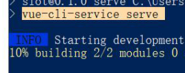


路由表

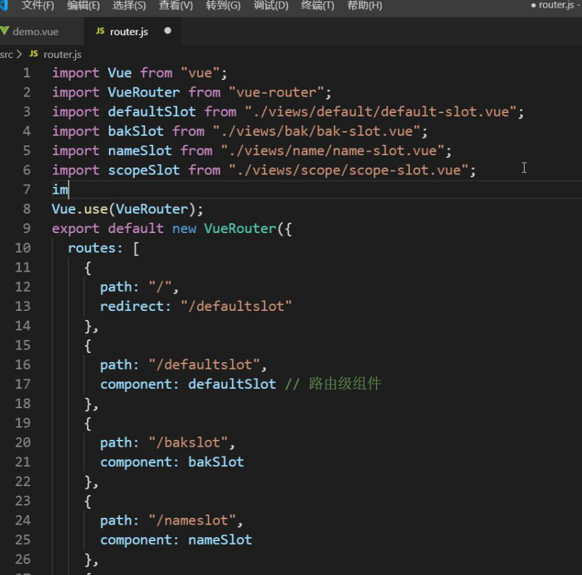

## 插槽的后背内容


## 具名插槽


## element 使用的过程中就是填坑的过程


下载引用


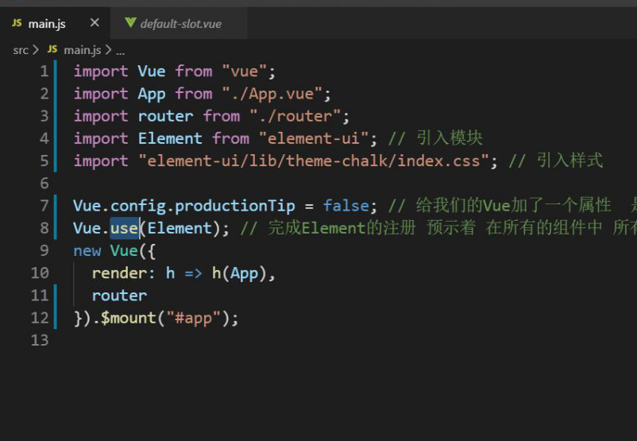


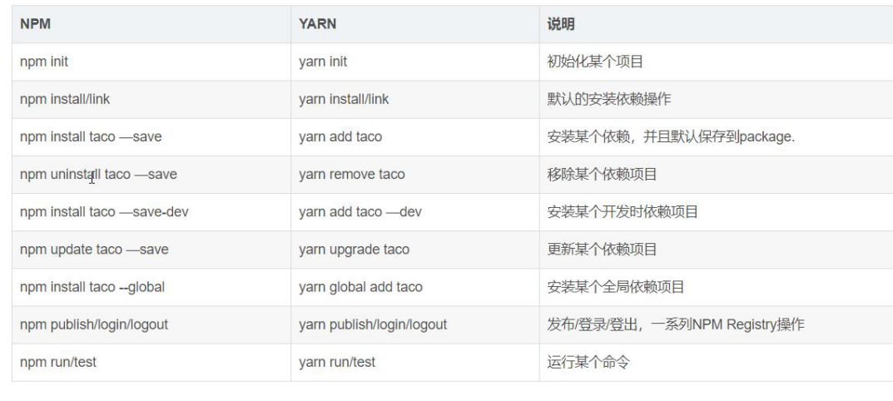


## 初始化项目


vue create

选中 三个选项

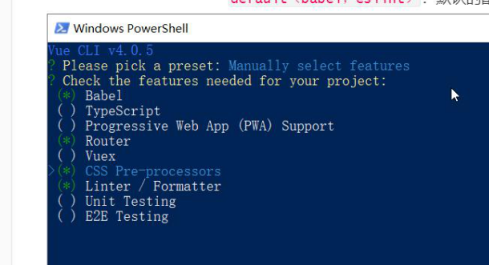

linter  做语法校验的

router 路由

css是 做css预处理的

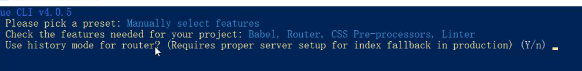

你想要什么样的方式去处理 路由

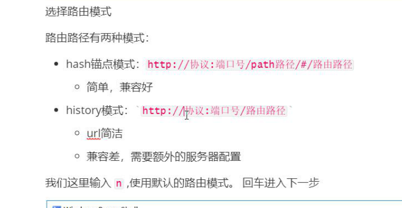


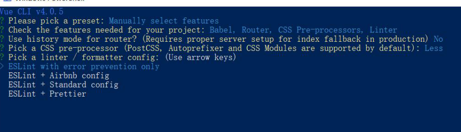

选中一个css 处理模式

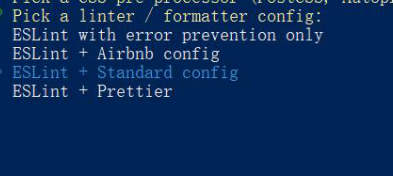


语法校验插件


重新建立一个新项目

##  重新做一遍


1. vue create 项目名, 
2. 配置文件

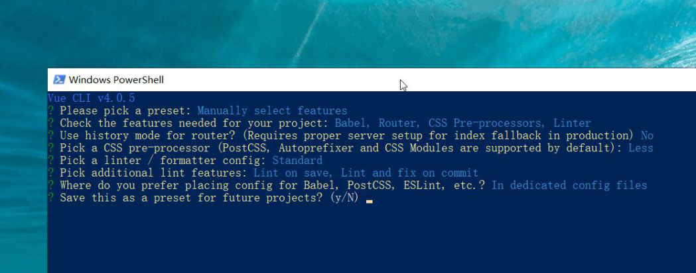


建立远程git仓库

推这个仓库

```git

```

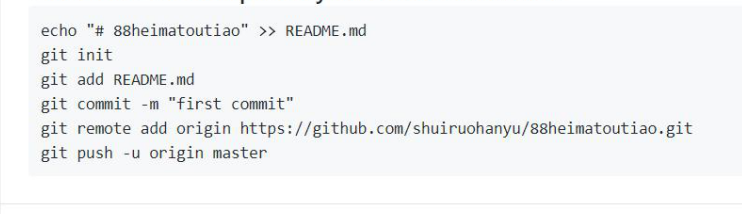

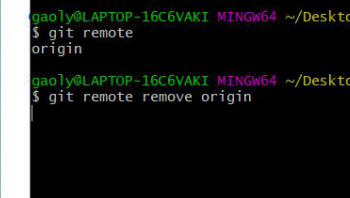

可以使用remove 删除这个链接记录

origin是项目的别名


安装element  包 

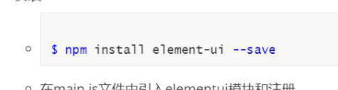

引入element

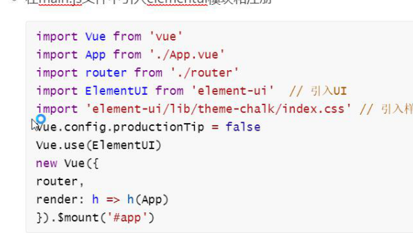

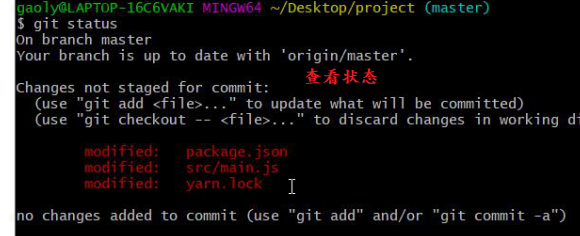


克隆老师项目的地址

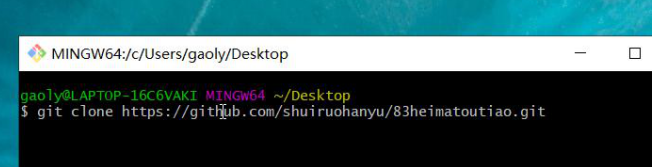